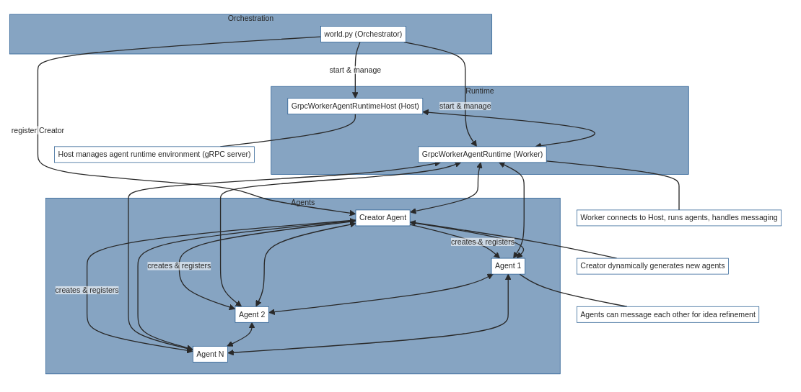

# Autogen Unleashed 100 agents swarm

## Overview

This project demonstrates the orchestration of a large number of autonomous AI agents using the [AutoGen](https://github.com/microsoft/autogen) framework. The system is designed to dynamically create, register, and coordinate up to 100 (configurable) AI agents, each with unique characteristics and business ideation capabilities. The agents interact via gRPC and can collaborate, refine each other's ideas, and generate creative outputs in parallel.

## Key Components

### 1. `creator.py`
- **Role:** The Creator agent is responsible for generating new AI agents on demand.
- **How it works:**
  - Receives a template (from `agent.py`) and a system message prompt.
  - Uses an LLM (OpenAI GPT-4o-mini) to generate Python code for a new agent class, ensuring each agent is unique in personality, interests, and goals.
  - Dynamically writes the new agent's code to a file and registers it with the runtime.
  - After creation, the Creator can prompt the new agent for a business idea and return the result.
- **Benefit:** Enables scalable, on-the-fly creation of diverse agents, each with their own behaviors and specializations.

### 2. `agent.py`
- **Role:** Template and base logic for business-idea-generating agents.
- **How it works:**
  - Defines a system message and behavioral parameters (e.g., interests, risk appetite, communication style).
  - Handles incoming messages, generates business ideas, and may choose to "bounce" ideas off other agents for refinement.
  - Uses randomness to simulate collaboration and diversity in responses.
- **Benefit:** Provides a flexible, extensible base for agent personalities and behaviors, supporting creativity and collaboration.

### 3. `messages.py`
- **Role:** Defines the message structure and recipient selection logic.
- **How it works:**
  - `Message` dataclass encapsulates message content.
  - `find_recipient()` randomly selects another agent (excluding the sender) for idea refinement, supporting agent-to-agent collaboration.
- **Benefit:** Simple, extensible messaging and routing system for agent communication.

### 4. `world.py`
- **Role:** Orchestrates the entire system.
- **How it works:**
  - Starts the gRPC runtime host and worker.
  - Registers the Creator agent.
  - Spawns multiple coroutines to create and message agents in parallel.
  - Collects and saves each agent's output to markdown files.
- **Benefit:** Demonstrates scalable, concurrent orchestration of many agents, leveraging async and gRPC for efficiency.

## Architecture Diagram



## How It Works
1. The system starts a gRPC host and worker runtime.
2. The Creator agent is registered and used to generate new agent code files (e.g., `agent1.py`, `agent2.py`, ...).
3. Each new agent is registered and can receive messages.
4. The Creator sends a prompt to each agent, asking for a business idea.
5. Agents may collaborate by refining each other's ideas, simulating a creative team.
6. All ideas are saved to markdown files for review.

## Benefits of Using AutoGen
- **Dynamic Agent Creation:** AutoGen enables the system to generate and register new agents at runtime, each with unique logic and personality.
- **LLM-Powered Customization:** Agents are created using LLMs, allowing for creative, diverse, and contextually rich agent behaviors.
- **Scalability:** The system can orchestrate dozens or hundreds of agents concurrently, thanks to async programming and gRPC communication.
- **Collaboration:** Agents can interact, critique, and refine each other's outputs, simulating a real-world creative team.
- **Extensibility:** The modular design (Creator, Agent, Messaging) makes it easy to add new agent types, behaviors, or communication patterns.

## Getting Started

1. **Install dependencies:**
   - Ensure you have Python 3.8+ and install requirements (see project root or relevant requirements.txt).
2. **Set up environment:**
   - Place your OpenAI API key and other secrets in a `.env` file.
3. **Run the orchestrator:**
   - Execute `world.py` to start the system and generate agent outputs.

```bash
uv run world.py
```

4. **Review outputs:**
   - Generated business ideas will be saved as `idea1.md`, `idea2.md`, etc.


## Project Structure
```
|-- agent.py         # Agent template and logic
|-- creator.py       # Creator agent for dynamic agent generation
|-- messages.py      # Messaging and recipient selection
|-- world.py         # Orchestration and runtime
|-- ideaN.md         # Output files with generated ideas
```

## Why AutoGen?
AutoGen provides a powerful framework for building, customizing, and orchestrating LLM-powered agents. In this project, it enables:
- **Rapid prototyping** of new agent personalities and behaviors.
- **Seamless integration** with LLMs for creative code and idea generation.
- **Robust communication** between agents using modern async and gRPC technologies.

By leveraging AutoGen, this project showcases the future of scalable, collaborative, and creative AI agent ecosystems. 